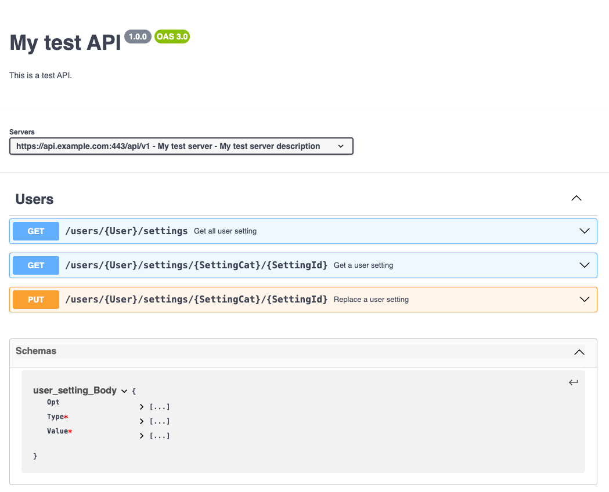

# apio

This is a **very** experimental declarative server- and client-side http API library for Go.
It is inspired by Tapir (scala). It's just a proof of concept. I have stopped working on it,
because it is too much work and just inventing a solution for a non-existing problem :D.
!!! Just generate code from OpenAPI specs instead !!!

You define your API in a type-safe way with declarative Go code, and then
get access to type safe client and server APIs in go (no code generation).

You can also (in theory ;)) generate a swagger spec from the API definition.

It asks the question:

* What do we need to describe an API entirely within the Go type system, but to be able to always generate a valid API
  specification from it? (ofc it also has to work :D)

## Example

### API definition

An API consists of one or more resources, each with one or more endpoints:

```go
package user_setting

import (
	. "github.com/GiGurra/apio/pkg/apio"
	"net/http"
)

// Path represents "/users/:user/settings/:settingCat/:settingId"
type Path struct {
	_          any `path:"/users"`
	User       int
	_          any `path:"/settings"`
	SettingCat string
	SettingId  string
}

type Query struct {
	Foo *string
	Bar int
}

type Body struct {
	Value any     `json:"value"`
	Type  string  `json:"type"`
	Opt   *string `json:"opt"`
}

type Headers struct {
	Yo          any
	ContentType string `name:"Content-Type"`
}

type RespHeaders struct {
	ContentType string `name:"Content-Type"`
}

var Get = Endpoint[
	EndpointInput[Headers, Path, Query, X],
	EndpointOutput[X, Body],
]{Method: http.MethodGet}

var Put = Endpoint[
	EndpointInput[X, Path, X, Body],
	EndpointOutput[RespHeaders, X],
]{Method: http.MethodPut}

```

### Server

Then we create a server, for example with Echo Server:
(but it could be any server implementation)

```go
package main

import (
	"fmt"
	"github.com/GiGurra/apio/cmd/examples/user_setting"
	. "github.com/GiGurra/apio/pkg/apio"
	"github.com/labstack/echo/v4"
)

func UserSettingEndpoints() []EndpointBase {

	return []EndpointBase{

		user_setting.Get.
			WithHandler(func(
				input EndpointInput[user_setting.Headers, user_setting.Path, user_setting.Query, X],
			) (EndpointOutput[X, user_setting.Body], error) {
				fmt.Printf("invoked GET path with input: %+v\n", input)
				return BodyResponse(user_setting.Body{
					Value: "testValue",
					Type:  fmt.Sprintf("input=%+v", input),
				}), nil
			}),

		user_setting.Put.
			WithHandler(func(
				input EndpointInput[X, user_setting.Path, X, user_setting.Body],
			) (EndpointOutput[user_setting.RespHeaders, X], error) {
				fmt.Printf("invoked PUT path with input: %+v\n", input)
				return HeadersResponse(user_setting.RespHeaders{
					ContentType: "application/json",
				}), nil
			}),
	}
}

func main() {
	var testApi = Api{
		Name: "My test API",
		Servers: []Server{{
			Scheme:   "https",
			Host:     "api.example.com",
			Port:     443,
			BasePath: "/api/v1",
			HttpVer:  "1.1",
		}},
		IntBasePath: "/api/v1",
	}.WithEndpoints(
		UserSettingEndpoints()...,
	).Validate()

	echoServer := echo.New()

	EchoInstall(echoServer, &testApi)

	_ = echoServer.Start(":8080")
}


```

### Client

Lastly, we can for example make RPC calls to the endpoints like this:

```go
package main

import (
	"fmt"
	"github.com/GiGurra/apio/cmd/examples/user_setting"
	. "github.com/GiGurra/apio/pkg/apio"
)

func ptr[T any](v T) *T {
	return &v
}

func main() {
	server := Server{
		Scheme:   "http",
		Host:     "localhost",
		Port:     8080,
		BasePath: "/api/v1",
		HttpVer:  "1.1",
	}

	input := NewInput(
		user_setting.Headers{
			Yo:          "yo",
			ContentType: "application/json",
		},
		user_setting.Path{
			User:       123,
			SettingCat: "cat",
			SettingId:  "id",
		},
		user_setting.Query{
			Foo: ptr("foo"),
			Bar: 123,
		},
		Empty, // no body in this get call
	)

	res, err := user_setting.Get.RPC(server, input, DefaultOpts())
	if err != nil {
		panic(fmt.Sprintf("failed to call RPC GET endpoint: %v", err))
	}

	fmt.Printf("res: %+v\n", res)
}

```

### OpenAPI 3 spec

We can also generate an OpenAPI 3 spec from the API definition:

```go
package main

import (
	"encoding/json"
	"fmt"
	"github.com/GiGurra/apio/cmd/examples/user_setting"
	. "github.com/GiGurra/apio/pkg/apio"
	"github.com/GiGurra/apio/pkg/apio/openapi3"
	"github.com/labstack/echo/v4"
)

func main() {
	testApi := Api{
		Name:        "My test API",
		Description: "This is a test API.",
		Version:     "1.0.0",
		Servers: []Server{{
			Name:        "My test server",
			Description: "My test server description",
			Scheme:      "https",
			Host:        "api.example.com",
			Port:        443,
			BasePath:    "/api/v1",
			HttpVer:     "1.1",
		}},
		IntBasePath: "/api/v1",
	}.WithEndpoints(
		UserSettingEndpoints()...,
	).Validate()

	openApi3 := openapi3.ToOpenApi3(testApi)
	openApi3Json, err := json.MarshalIndent(openApi3, "", "  ")
	if err != nil {
		panic(fmt.Errorf("failed to marshal OpenAPI 3 spec: %v", err))
	}

	fmt.Printf("OpenAPI 3 spec:\n")
	fmt.Printf("%s\n", openApi3Json) // Paste this in your favorite OpenAPI 3 editor

}


```



